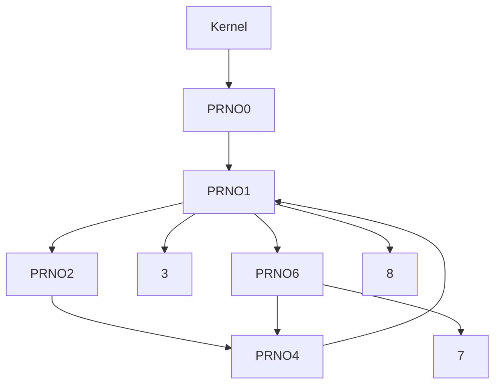

# Program Flow

Execution begins at 0x0000 with the file `"      "` (which I call `KERNEL`), loaded from either the v1.0 or v1.1 Sorcerian disk.

```mermaid
flowchart TD
    K[Kernel] --> 0
    0[PRNO0] --> 1
    1[PRNO1] --> 2
    1 --> 3
    1 --> 6
    1 --> 8
    2[PRNO2] --> 4
    4[PRNO4] --> 1
    6[PRNO6] --> 4
    6 --> 7
```
